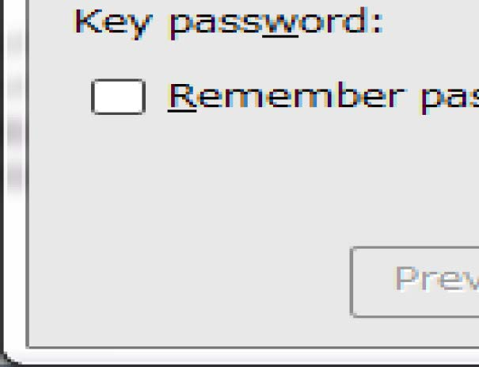

#### 4.3.1.4 创建/使用内部内容供应器

内部内容供应器禁止除内部应用以外的应用使用。

下面展示了如何实现内部内容供应器的示例代码。

要点（创建内容供应器）：

1) 定义内部签名权限。

2) 需要内部签名权限。

3) 将导出属性显式设置为`true`。

4) 验证内部签名权限是否由内部应用定义。

5) 验证参数的安全性，即使这是来自内部应用的请求。

6) 由于请求应用是内部的，因此可以返回敏感信息。

7) 导出 APK 时，请使用与请求应用相同的开发者密钥对 APK 进行签名。

AndroidManifest.xml

```xml
<?xml version="1.0" encoding="utf-8"?>
<manifest xmlns:android="http://schemas.android.com/apk/res/android"
    package="org.jssec.android.provider.inhouseprovider">
    <!-- *** POINT 1 *** Define an in-house signature permission -->
    <permission
    android:name="org.jssec.android.provider.inhouseprovider.MY_PERMISSION"
    android:protectionLevel="signature" />
    <application
        android:icon="@drawable/ic_launcher"
        android:label="@string/app_name" >
        <!-- *** POINT 2 *** Require the in-house signature permission -->
        <!-- *** POINT 3 *** Explicitly set the exported attribute to true. -->
        <provider
        android:name=".InhouseProvider"
        android:authorities="org.jssec.android.provider.inhouseprovider"
        android:permission="org.jssec.android.provider.inhouseprovider.MY_PERMISSION"
        android:exported="true" />
    </application>
</manifest>
```

InhouseProvider.java

```java
package org.jssec.android.provider.inhouseprovider;

import org.jssec.android.shared.SigPerm;
import org.jssec.android.shared.Utils;
import android.content.ContentProvider;
import android.content.ContentUris;
import android.content.ContentValues;
import android.content.Context;
import android.content.UriMatcher;
import android.database.Cursor;
import android.database.MatrixCursor;
import android.net.Uri;

public class InhouseProvider extends ContentProvider {

    public static final String AUTHORITY = "org.jssec.android.provider.inhouseprovider";
    public static final String CONTENT_TYPE = "vnd.android.cursor.dir/vnd.org.jssec.contenttype";
    public static final String CONTENT_ITEM_TYPE = "vnd.android.cursor.item/vnd.org.jssec.contenttype";
    // Expose the interface that the Content Provider provides.
    
    public interface Download {
        public static final String PATH = "downloads";
        public static final Uri CONTENT_URI = Uri.parse("content://" + AUTHORITY + "/" + PATH);
    }
    
    public interface Address {
        public static final String PATH = "addresses";
        public static final Uri CONTENT_URI = Uri.parse("content://" + AUTHORITY + "/" + PATH);
    }
    
    // UriMatcher
    private static final int DOWNLOADS_CODE = 1;
    private static final int DOWNLOADS_ID_CODE = 2;
    private static final int ADDRESSES_CODE = 3;
    private static final int ADDRESSES_ID_CODE = 4;
    private static UriMatcher sUriMatcher;
    
    static {
        sUriMatcher = new UriMatcher(UriMatcher.NO_MATCH);
        sUriMatcher.addURI(AUTHORITY, Download.PATH, DOWNLOADS_CODE);
        sUriMatcher.addURI(AUTHORITY, Download.PATH + "/#", DOWNLOADS_ID_CODE);
        sUriMatcher.addURI(AUTHORITY, Address.PATH, ADDRESSES_CODE);
        sUriMatcher.addURI(AUTHORITY, Address.PATH + "/#", ADDRESSES_ID_CODE);
    }
    
    // Since this is a sample program,
    // query method returns the following fixed result always without using database.
    private static MatrixCursor sAddressCursor = new MatrixCursor(new String[] { "_id", "city" });
    
    static {
        sAddressCursor.addRow(new String[] { "1", "New York" });
        sAddressCursor.addRow(new String[] { "2", "London" });
        sAddressCursor.addRow(new String[] { "3", "Paris" });
    }
    
    private static MatrixCursor sDownloadCursor = new MatrixCursor(new String[] { "_id", "path" });
    
    static {
        sDownloadCursor.addRow(new String[] { "1", "/sdcard/downloads/sample.jpg" });
        sDownloadCursor.addRow(new String[] { "2", "/sdcard/downloads/sample.txt" });
    }
    
    // In-house Signature Permission
    private static final String MY_PERMISSION = "org.jssec.android.provider.inhouseprovider.MY_PERMISSION";
    // In-house certificate hash value
    private static String sMyCertHash = null;
    
    private static String myCertHash(Context context) {
        if (sMyCertHash == null) {
            if (Utils.isDebuggable(context)) {
                // Certificate hash value of "androiddebugkey" in the debug.keystore.
                sMyCertHash = "0EFB7236 328348A9 89718BAD DF57F544 D5CCB4AE B9DB34BC 1E29DD26 F77C8255";
            } else {
                // Certificate hash value of "my company key" in the keystore.
                sMyCertHash = "D397D343 A5CBC10F 4EDDEB7C A10062DE 5690984F 1FB9E88B D7B3A7C2 42E142CA";
            }
        }
        return sMyCertHash;
    }
    
    @Override
    public boolean onCreate() {
        return true;
    }
    
    @Override
    public String getType(Uri uri) {
        switch (sUriMatcher.match(uri)) {
            case DOWNLOADS_CODE:
            case ADDRESSES_CODE:
                return CONTENT_TYPE;
            case DOWNLOADS_ID_CODE:
            case ADDRESSES_ID_CODE:
                return CONTENT_ITEM_TYPE;
            default:
                throw new IllegalArgumentException("Invalid URI:" + uri);
        }
    }
    
    @Override
    public Cursor query(Uri uri, String[] projection, String selection,
        String[] selectionArgs, String sortOrder) {
        // *** POINT 4 *** Verify if the in-house signature permission is defined by an in-house application.
        if (!SigPerm.test(getContext(), MY_PERMISSION, myCertHash(getContext()))) {
            throw new SecurityException("The in-house signature permission is not declared by in-house application.");
        }
        // *** POINT 5 *** Handle the received request data carefully and securely,
        // even though the data came from an in-house application.
        // Here, whether uri is within expectations or not, is verified by UriMatcher#match() and switch case.
        // Checking for other parameters are omitted here, due to sample.
        // Refer to "3.2 Handle Input Data Carefully and Securely."
        // *** POINT 6 *** Sensitive information can be returned since the requesting application is inhouse.
        // It depends on application whether the query result has sensitive meaning or not.
        switch (sUriMatcher.match(uri)) {
            case DOWNLOADS_CODE:
            case DOWNLOADS_ID_CODE:
                return sDownloadCursor;
            case ADDRESSES_CODE:
            case ADDRESSES_ID_CODE:
                return sAddressCursor;
            default:
                throw new IllegalArgumentException("Invalid URI:" + uri);
        }
    }
    
    @Override
    public Uri insert(Uri uri, ContentValues values) {
        // *** POINT 4 *** Verify if the in-house signature permission is defined by an in-house application.
        if (!SigPerm.test(getContext(), MY_PERMISSION, myCertHash(getContext()))) {
            throw new SecurityException("The in-house signature permission is not declared by in-house application.");
        }
        // *** POINT 5 *** Handle the received request data carefully and securely,
        // even though the data came from an in-house application.
        // Here, whether uri is within expectations or not, is verified by UriMatcher#match() and switch case.
        // Checking for other parameters are omitted here, due to sample.
        // Refer to "3.2 Handle Input Data Carefully and Securely."
        // *** POINT 6 *** Sensitive information can be returned since the requesting application is inhouse.
        // It depends on application whether the issued ID has sensitive meaning or not.
        switch (sUriMatcher.match(uri)) {
            case DOWNLOADS_CODE:
                return ContentUris.withAppendedId(Download.CONTENT_URI, 3);
            case ADDRESSES_CODE:
                return ContentUris.withAppendedId(Address.CONTENT_URI, 4);
            default:
                throw new IllegalArgumentException("Invalid URI:" + uri);
        }
    }
    
    @Override
    public int update(Uri uri, ContentValues values, String selection,
        String[] selectionArgs) {
        // *** POINT 4 *** Verify if the in-house signature permission is defined by an in-house application.
        if (!SigPerm.test(getContext(), MY_PERMISSION, myCertHash(getContext()))) {
            throw new SecurityException("The in-house signature permission is not declared by in-house application.");
        }
        // *** POINT 5 *** Handle the received request data carefully and securely,
        // even though the data came from an in-house application.
        // Here, whether uri is within expectations or not, is verified by UriMatcher#match() and switch case.
        // Checking for other parameters are omitted here, due to sample.
        // Refer to "3.2 Handle Input Data Carefully and Securely."
        // *** POINT 6 *** Sensitive information can be returned since the requesting application is inhouse.
        // It depends on application whether the number of updated records has sensitive meaning or not.
        switch (sUriMatcher.match(uri)) {
            case DOWNLOADS_CODE:
                return 5; // Return number of updated records
            case DOWNLOADS_ID_CODE:
                return 1;
            case ADDRESSES_CODE:
                return 15;
            case ADDRESSES_ID_CODE:
                return 1;
            default:
                throw new IllegalArgumentException("Invalid URI:" + uri);
        }
    }
    
    @Override
    public int delete(Uri uri, String selection, String[] selectionArgs) {
        // *** POINT 4 *** Verify if the in-house signature permission is defined by an in-house application.
        if (!SigPerm.test(getContext(), MY_PERMISSION, myCertHash(getContext()))) {
            throw new SecurityException("The in-house signature permission is not declared by in-house application.");
        }
        // *** POINT 5 *** Handle the received request data carefully and securely,
        // even though the data came from an in-house application.
        // Here, whether uri is within expectations or not, is verified by UriMatcher#match() and switch case.
        // Checking for other parameters are omitted here, due to sample.
        // Refer to "3.2 Handle Input Data Carefully and Securely."
        // *** POINT 6 *** Sensitive information can be returned since the requesting application is inhouse.
        // It depends on application whether the number of deleted records has sensitive meaning or not.
        switch (sUriMatcher.match(uri)) {
            case DOWNLOADS_CODE:
                return 10; // Return number of deleted records
            case DOWNLOADS_ID_CODE:
                return 1;
            case ADDRESSES_CODE:
                return 20;
            case ADDRESSES_ID_CODE:
                return 1;
            default:
                throw new IllegalArgumentException("Invalid URI:" + uri);
        }
    }
}
```

SigPerm.java

```java
package org.jssec.android.shared;

import android.content.Context;
import android.content.pm.PackageManager;
import android.content.pm.PackageManager.NameNotFoundException;
import android.content.pm.PermissionInfo;

public class SigPerm {

    public static boolean test(Context ctx, String sigPermName, String correctHash) {
        if (correctHash == null) return false;
        correctHash = correctHash.replaceAll(" ", "");
        return correctHash.equals(hash(ctx, sigPermName));
    }
    
    public static String hash(Context ctx, String sigPermName) {
        if (sigPermName == null) return null;
        try {
            // Get the package name of the application which declares a permission named sigPermName.
            PackageManager pm = ctx.getPackageManager();
            PermissionInfo pi;
            pi = pm.getPermissionInfo(sigPermName, PackageManager.GET_META_DATA);
            String pkgname = pi.packageName;
            // Fail if the permission named sigPermName is not a Signature Permission
            if (pi.protectionLevel != PermissionInfo.PROTECTION_SIGNATURE) return null;
            // Return the certificate hash value of the application which declares a permission named sigPermName.
            return PkgCert.hash(ctx, pkgname);
        } catch (NameNotFoundException e) {
            return null;
        }
    }
}
```

PkgCert.java

```java
package org.jssec.android.shared;

import java.security.MessageDigest;
import java.security.NoSuchAlgorithmException;
import android.content.Context;
import android.content.pm.PackageInfo;
import android.content.pm.PackageManager;
import android.content.pm.PackageManager.NameNotFoundException;
import android.content.pm.Signature;

public class PkgCert {

    public static boolean test(Context ctx, String pkgname, String correctHash) {
        if (correctHash == null) return false;
        correctHash = correctHash.replaceAll(" ", "");
        return correctHash.equals(hash(ctx, pkgname));
    }
    
    public static String hash(Context ctx, String pkgname) {
        if (pkgname == null) return null;
        try {
            PackageManager pm = ctx.getPackageManager();
            PackageInfo pkginfo = pm.getPackageInfo(pkgname, PackageManager.GET_SIGNATURES);
            if (pkginfo.signatures.length != 1) return null; // Will not handle multiple signatures.
            Signature sig = pkginfo.signatures[0];
            byte[] cert = sig.toByteArray();
            byte[] sha256 = computeSha256(cert);
            return byte2hex(sha256);
        } catch (NameNotFoundException e) {
            return null;
        }
    }
    
    private static byte[] computeSha256(byte[] data) {
        try {
            return MessageDigest.getInstance("SHA-256").digest(data);
        } catch (NoSuchAlgorithmException e) {
            return null;
        }
    }
    private static String byte2hex(byte[] data) {
        if (data == null) return null;
        final StringBuilder hexadecimal = new StringBuilder();
        for (final byte b : data) {
            hexadecimal.append(String.format("%02X", b));
        }
        return hexadecimal.toString();
    }
}
```

要点 7：导出 APK 时，请使用与请求应用相同的开发者密钥对 APK 进行签名。



下面是使用内部内容供应器的活动示例。

要点（使用内容个供应器）：

8) 声明使用内部签名权限。

9) 验证内部签名权限是否由内部应用定义。

10) 验证目标应用是否使用内部证书签名。

11) 由于目标应用是内部应用，因此可以发送敏感信息。

12) 即使数据来自内部应用，也要小心并安全地处理收到的结果数据。

13) 导出 APK 时，请使用与目标应用相同的开发人员密钥对 APK 进行签名。

AndroidManifest.xml

```xml
<?xml version="1.0" encoding="utf-8"?>
<manifest xmlns:android="http://schemas.android.com/apk/res/android"
    package="org.jssec.android.provider.inhouseuser">
    <!-- *** POINT 8 *** Declare to use the in-house signature permission. -->
    <uses-permission
    android:name="org.jssec.android.provider.inhouseprovider.MY_PERMISSION" />
    <application
        android:icon="@drawable/ic_launcher"
        android:label="@string/app_name" >
        <activity
            android:name=".InhouseUserActivity"
            android:label="@string/app_name"
            android:exported="true" >
            <intent-filter>
                <action android:name="android.intent.action.MAIN" />
                <category android:name="android.intent.category.LAUNCHER" />
            </intent-filter>
        </activity>
    </application>
</manifest>
```

InhouseUserActivity.java

```java
package org.jssec.android.provider.inhouseuser;

import org.jssec.android.shared.PkgCert;
import org.jssec.android.shared.SigPerm;
import org.jssec.android.shared.Utils;
import android.app.Activity;
import android.content.ContentValues;
import android.content.Context;
import android.content.pm.PackageManager;
import android.content.pm.ProviderInfo;
import android.database.Cursor;
import android.net.Uri;
import android.os.Bundle;
import android.view.View;
import android.widget.TextView;

public class InhouseUserActivity extends Activity {

    // Target Content Provider Information
    private static final String AUTHORITY = "org.jssec.android.provider.inhouseprovider";
    
    private interface Address {
        public static final String PATH = "addresses";
        public static final Uri CONTENT_URI = Uri.parse("content://" + AUTHORITY + "/" + PATH);
    }
    
    // In-house Signature Permission
    private static final String MY_PERMISSION = "org.jssec.android.provider.inhouseprovider.MY_PERMISSION";
    // In-house certificate hash value
    private static String sMyCertHash = null;
    
    private static String myCertHash(Context context) {
        if (sMyCertHash == null) {
            if (Utils.isDebuggable(context)) {
                // Certificate hash value of "androiddebugkey" in the debug.keystore.
                sMyCertHash = "0EFB7236 328348A9 89718BAD DF57F544 D5CCB4AE B9DB34BC 1E29DD26 F77C8255";
            } else {
                // Certificate hash value of "my company key" in the keystore.
                sMyCertHash = "D397D343 A5CBC10F 4EDDEB7C A10062DE 5690984F 1FB9E88B D7B3A7C2 42E142CA";
            }
        }
        return sMyCertHash;
    }
    
    // Get package name of target content provider.
    private static String providerPkgname(Context context, Uri uri) {
        String pkgname = null;
        PackageManager pm = context.getPackageManager();
        ProviderInfo pi = pm.resolveContentProvider(uri.getAuthority(), 0);
        if (pi != null) pkgname = pi.packageName;
        return pkgname;
    }
    
    public void onQueryClick(View view) {
        logLine("[Query]");
        // *** POINT 9 *** Verify if the in-house signature permission is defined by an in-house application.
        if (!SigPerm.test(this, MY_PERMISSION, myCertHash(this))) {
            logLine(" The in-house signature permission is not declared by in-house application.");
            return;
        }
        // *** POINT 10 *** Verify if the destination application is signed with the in-house certificate.
        String pkgname = providerPkgname(this, Address.CONTENT_URI);
        if (!PkgCert.test(this, pkgname, myCertHash(this))) {
            logLine(" The target content provider is not served by in-house applications.");
            return;
        }
        Cursor cursor = null;
        try {
            // *** POINT 11 *** Sensitive information can be sent since the destination application is in-house one.
            cursor = getContentResolver().query(Address.CONTENT_URI, null, null, null, null);
            // *** POINT 12 *** Handle the received result data carefully and securely,
            // even though the data comes from an in-house application.
            // Omitted, since this is a sample. Please refer to "3.2 Handling Input Data Carefully and Securely."
                if (cursor == null) {
            logLine(" null cursor");
            } else {
                boolean moved = cursor.moveToFirst();
                while (moved) {
                    logLine(String.format(" %d, %s", cursor.getInt(0), cursor.getString(1)));
                    moved = cursor.moveToNext();
                }
            }
        } finally {
            if (cursor != null) cursor.close();
        }
    }
    
    public void onInsertClick(View view) {
        logLine("[Insert]");
        // *** POINT 9 *** Verify if the in-house signature permission is defined by an in-house application.
        String correctHash = myCertHash(this);
        if (!SigPerm.test(this, MY_PERMISSION, correctHash)) {
            logLine(" The in-house signature permission is not declared by in-house application.");
            return;
        }
        // *** POINT 10 *** Verify if the destination application is signed with the in-house certificate.
        String pkgname = providerPkgname(this, Address.CONTENT_URI);
        if (!PkgCert.test(this, pkgname, correctHash)) {
            logLine(" The target content provider is not served by in-house applications.");
            return;
        }
        // *** POINT 11 *** Sensitive information can be sent since the destination application is in-house one.
        ContentValues values = new ContentValues();
        values.put("city", "Tokyo");
        Uri uri = getContentResolver().insert(Address.CONTENT_URI, values);
        // *** POINT 12 *** Handle the received result data carefully and securely,
        // even though the data comes from an in-house application.
        // Omitted, since this is a sample. Please refer to "3.2 Handling Input Data Carefully and Securely."
        logLine(" uri:" + uri);
    }
    
    public void onUpdateClick(View view) {
        logLine("[Update]");
        // *** POINT 9 *** Verify if the in-house signature permission is defined by an in-house application.
        String correctHash = myCertHash(this);
        if (!SigPerm.test(this, MY_PERMISSION, correctHash)) {
            logLine(" The in-house signature permission is not declared by in-house application.");
            return;
        }
        // *** POINT 10 *** Verify if the destination application is signed with the in-house certificate.
        String pkgname = providerPkgname(this, Address.CONTENT_URI);
        if (!PkgCert.test(this, pkgname, correctHash)) {
            logLine(" The target content provider is not served by in-house applications.");
            return;
        }
        // *** POINT 11 *** Sensitive information can be sent since the destination application is in-house one.
        ContentValues values = new ContentValues();
        values.put("city", "Tokyo");
        String where = "_id = ?";
        String[] args = { "4" };
        int count = getContentResolver().update(Address.CONTENT_URI, values, where, args);
        // *** POINT 12 *** Handle the received result data carefully and securely,
        // even though the data comes from an in-house application.
        // Omitted, since this is a sample. Please refer to "3.2 Handling Input Data Carefully and Securely."
        logLine(String.format(" %s records updated", count));
    }
    
    public void onDeleteClick(View view) {
        logLine("[Delete]");
        // *** POINT 9 *** Verify if the in-house signature permission is defined by an in-house application.
        String correctHash = myCertHash(this);
        if (!SigPerm.test(this, MY_PERMISSION, correctHash)) {
            logLine(" The target content provider is not served by in-house applications.");
            return;
        }
        // *** POINT 10 *** Verify if the destination application is signed with the in-house certificat
        e.
        String pkgname = providerPkgname(this, Address.CONTENT_URI);
        if (!PkgCert.test(this, pkgname, correctHash)) {
            logLine(" The target content provider is not served by in-house applications.");
            return;
        }
        // *** POINT 11 *** Sensitive information can be sent since the destination application is in-ho
        use one.
        int count = getContentResolver().delete(Address.CONTENT_URI, null, null);
        // *** POINT 12 *** Handle the received result data carefully and securely,
        // even though the data comes from an in-house application.
        // Omitted, since this is a sample. Please refer to "3.2 Handling Input Data Carefully and Securely."
        logLine(String.format(" %s records deleted", count));
    }
    
    private TextView mLogView;
    
    @Override
    public void onCreate(Bundle savedInstanceState) {
        super.onCreate(savedInstanceState);
        setContentView(R.layout.main);
        mLogView = (TextView)findViewById(R.id.logview);
    }
    
    private void logLine(String line) {
        mLogView.append(line);
        mLogView.append("¥n");
    }
}
```

SigPerm.java

```java
package org.jssec.android.shared;

import android.content.Context;
import android.content.pm.PackageManager;
import android.content.pm.PackageManager.NameNotFoundException;
import android.content.pm.PermissionInfo;

public class SigPerm {

    public static boolean test(Context ctx, String sigPermName, String correctHash) {
        if (correctHash == null) return false;
        correctHash = correctHash.replaceAll(" ", "");
        return correctHash.equals(hash(ctx, sigPermName));
    }
    
    public static String hash(Context ctx, String sigPermName) {
        if (sigPermName == null) return null;
        try {
            // Get the package name of the application which declares a permission named sigPermName.
            PackageManager pm = ctx.getPackageManager();
            PermissionInfo pi;
            pi = pm.getPermissionInfo(sigPermName, PackageManager.GET_META_DATA);
            String pkgname = pi.packageName;
            // Fail if the permission named sigPermName is not a Signature Permission
            if (pi.protectionLevel != PermissionInfo.PROTECTION_SIGNATURE) return null;
            // Return the certificate hash value of the application which declares a permission named sigPermName.
            return PkgCert.hash(ctx, pkgname);
        } catch (NameNotFoundException e) {
            return null;
        }
    }
}
```

PkgCert.java

```java
package org.jssec.android.shared;

import java.security.MessageDigest;
import java.security.NoSuchAlgorithmException;
import android.content.Context;
import android.content.pm.PackageInfo;
import android.content.pm.PackageManager;
import android.content.pm.PackageManager.NameNotFoundException;
import android.content.pm.Signature;

public class PkgCert {

    public static boolean test(Context ctx, String pkgname, String correctHash) {
        if (correctHash == null) return false;
        correctHash = correctHash.replaceAll(" ", "");
        return correctHash.equals(hash(ctx, pkgname));
    }
    
    public static String hash(Context ctx, String pkgname) {
        if (pkgname == null) return null;
        try {
            PackageManager pm = ctx.getPackageManager();
            PackageInfo pkginfo = pm.getPackageInfo(pkgname, PackageManager.GET_SIGNATURES);
            if (pkginfo.signatures.length != 1) return null; // Will not handle multiple signatures.
            Signature sig = pkginfo.signatures[0];
            byte[] cert = sig.toByteArray();
            byte[] sha256 = computeSha256(cert);
            return byte2hex(sha256);
        } catch (NameNotFoundException e) {
            return null;
        }
    }
    
    private static byte[] computeSha256(byte[] data) {
        try {
            return MessageDigest.getInstance("SHA-256").digest(data);
        } catch (NoSuchAlgorithmException e) {
            return null;
        }
    }
    
    private static String byte2hex(byte[] data) {
        if (data == null) return null;
        final StringBuilder hexadecimal = new StringBuilder();
        for (final byte b : data) {
            hexadecimal.append(String.format("%02X", b));
        }
        return hexadecimal.toString();
    }
}
```

要点 13：导出 APK 时，请使用与请求应用相同的开发者密钥对 APK 进行签名。


